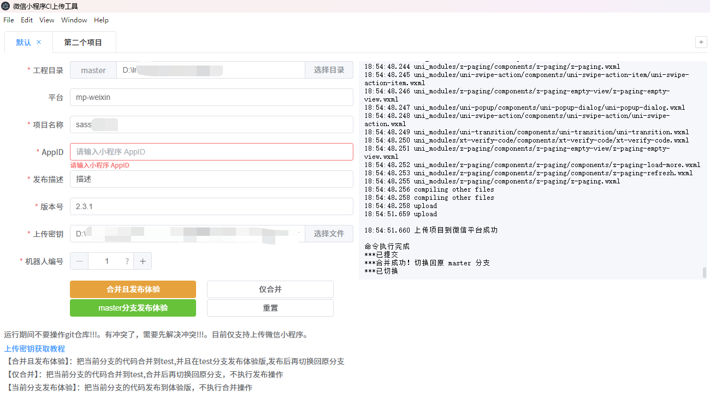

# weiXinMP_CI_Upload

微信小程序 ci 上传工具，支持合并代码到 test 分支并发布体验版，也支持仅合并代码到 test 分支。
一键操作，解放双手！！！
使用环境：
`electron 28.0.0` `node 23.3.0` `npm 10.9.0` or `pnpm 10.4.0`

启动：

1. 安装依赖：`pnpm install`
2. 启动项目：`pnpm run start`
3. 打包项目：`pnpm run build`

注意事项：

- HBuilder X 必需设置环境变量([点击跳转](https://hx.dcloud.net.cn/cli/env))

- HBuilder X 必需和本工具同时运行,才能使用它的 cli.exe 程序，让该工具正常使用

- HBuilder X 必须已安装 weapp-miniprogram-ci 插件。([点击跳转](https://ext.dcloud.net.cn/plugin?name=weapp-miniprogram-ci))

- 必须是 DCloud appid 的项目成员([点击跳转](https://dev.dcloud.net.cn))

- 必须有安装 git,并且配置好环境变量([点击跳转](https://git-scm.com/book/zh/v2/%E8%B5%B7%E6%AD%A5-%E5%AE%89%E8%A3%85-Git))

- 获取小程序上传密钥。如果你的公网出口 ip 是固定的，可开启并配置。否则关闭白名单([点击跳转](https://hx.dcloud.net.cn/cli/publish-mp-weixin?id=uploadprivatekey))

- 完成以上配置即可开始使用

- 目前仅支持使用 HBuilder 所开发的 uni-app 项目上传微信小程序

`运行期间不要操作 git 仓库!!!`
`有冲突了，需要先解决冲突!!!,然后手动回到原分支`

